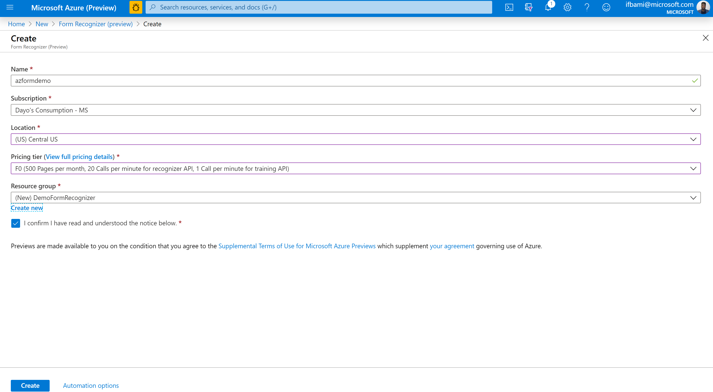
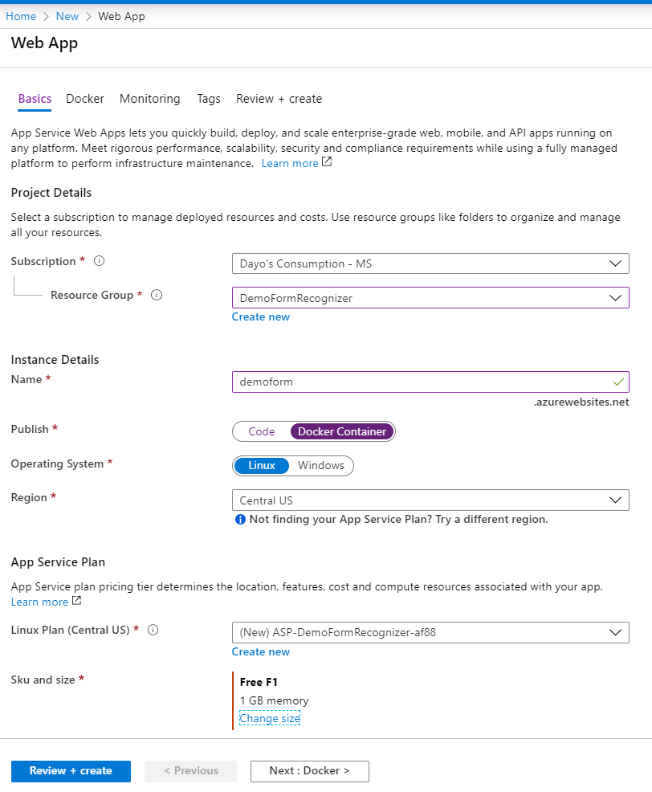
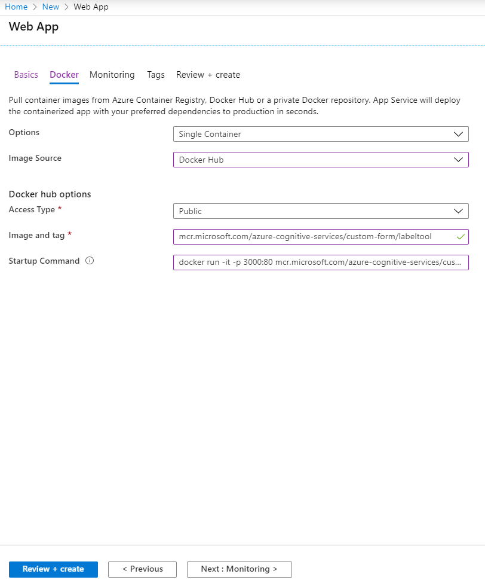
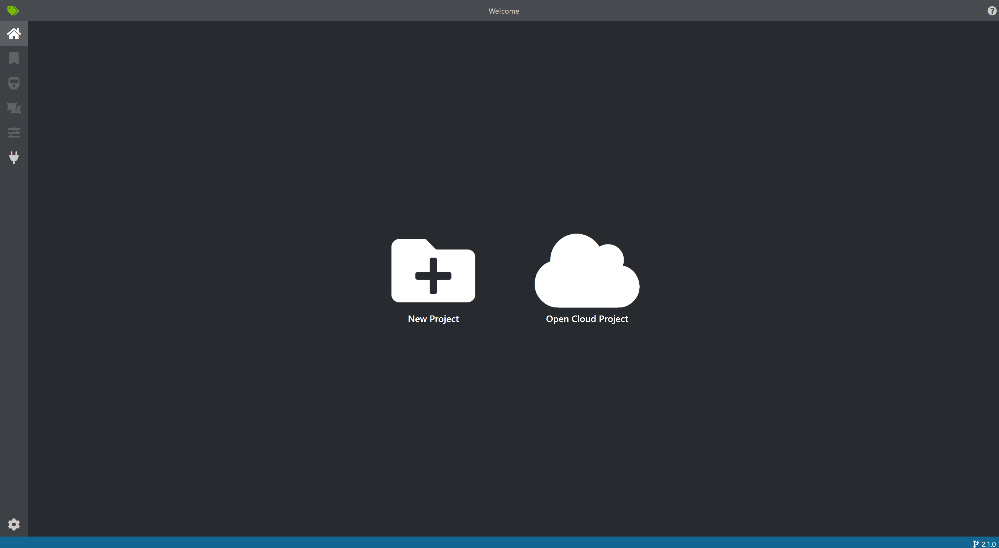

# Form Recognizer &amp; Power Platform

## **Requirements**

1. Azure Subscription

## **Setup Form Recognizer**

1. Open your browser, navigate to https://portal.azure.com, and log in with your Azure subscription credentials.
2. Select &quot;_Create a Resource_&quot;
3. Search for &quot;_Form Recognizer_&quot;
4. Click &quot;_Create_&quot;
5. Fill in the following information:
  + Name: azformdemo
  + Location: centralus
  + Pricing Tier: F0
  + Resource Group: DemoFormRecognizer

    

  + Select &quot;Create&quot;

## **Setup Form Recognizer Labeling Tool**

1. Select &quot;_Create a Resource_&quot;
2. Select &quot;_Web App_ &quot;
3. On the **Basics** Tab. Fill in the following information:
    + Resource Group: DemoFormRecognizer 
    + Name: &quot;_type a uniquename_&quot;
    + Publish: Docker Container
    + Region: Central US
    + Sku and size: &quot;_choose Dev/Test for a cheaper or free size _&quot;
  

4. On the **Docker** Tab. Fill in the following information:
    + Image Source: Docker Hub
    + Image and Tag: *mcr.microsoft.com/azure-cognitive-services/custom-form/labeltool*
    + Startup Command: *docker run -it -p 3000:80 mcr.microsoft.com/azure-cognitive-services/custom-form/labeltool eula=accept*
    

5. Select *Review + Create*

6. Access the tool by going to the url

    

