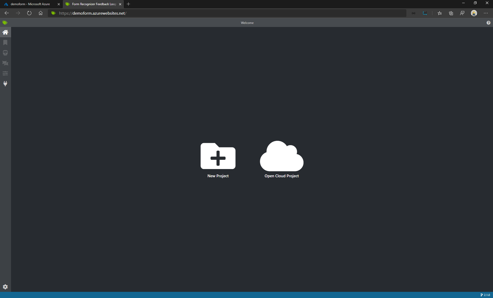

**Form Recognizer &amp; Power Platform**

**Requirements**

1. Azure Subscription
2. Power Apps

**Setup Form Recognizer**

1. Open your browser, navigate to https://portal.azure.com, and log in with your Azure subscription credentials.
2. Select &quot;_Create a Resource_&quot;
3. Search for &quot;_Form Recognizer_&quot;
4. Click &quot;_Create_&quot;
5. Fill in the following information:
  + Name: azformdemo
  + Location: centralus
  + Pricing Tier: F0
  + Resource Group: DemoFormRecognizer

 

  + Select &quot;Create&quot;


**Setup VM Form Recognizer Labeling Tool**

1. Open this [Link](https://azure.microsoft.com/en-us/resources/templates/docker-simple-on-ubuntu/) to create a Linux VM with Docker Engine
2. Click &quot;_Deploy to Azure_&quot;
3. Fill in the following information:


  + _Resource Group_: DemoFormRecognizer (same as the one created earlier)
  + _Admin Username_: azureadmin
  + _DNS Name_: \&lt;azfr\&gt; \*make sure it is a unique name
  + _Ubuntu_: select the latest version
  + _Authentication Type_: password
  + _Password_:  Type in a Strong Password
  + Select the checkbox to accept terms and conditions
  + Select &quot;Purchase&quot;

**Install Labeling Tool **

1. Once the Ubuntu Server is created. Go to [https://shell.azure.com/](https://shell.azure.com/) for a Bash environment
2. Copy the _Public IP Address_ from the _Overview_
3. Select your Directory
4. In the Bash environment type in ssh azureadmin@\&lt;DNS name\&gt;
5. It&#39;ll ask you to confirm connection. Type &quot;Yes&quot;
6. Type in your password
7. Type in &quot;sudo su&quot; for elevate priviledge
8. Install the Labeling tool by running the following commands:

```
docker pull mcr.microsoft.com/azure-cognitive-services/custom-form/labeltool
```
```
docker run -it -p 5000:80 mcr.microsoft.com/azure-cognitive-services/custom-form/labeltool eula=accept
```
 
9. Head back into your VM under Networking and select &quot;_Add Inbounding Port Rule&quot;_

  a.
 
 b. Specify the port range as “5000” and select “Add”
 


10. Now head over to the Labelling Tool by opening a new tab and type in  &lt;DNS Name>:5000. You should see the labeling tool

